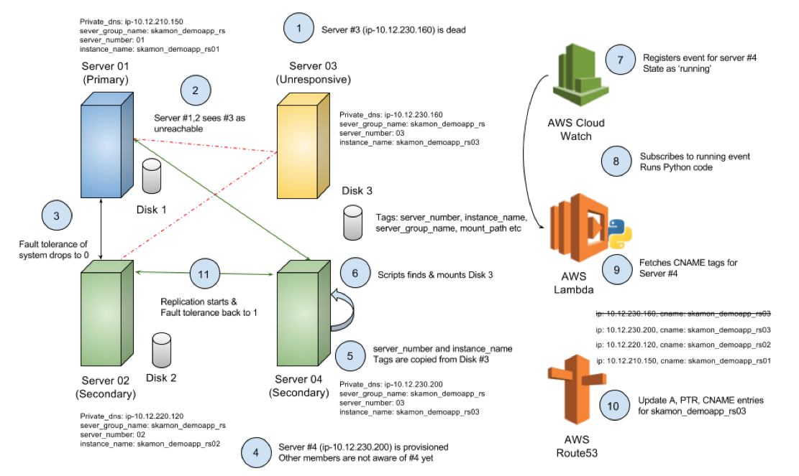

# Sleep better at night! Here is how to respawn a MongoDB Server automatically!

## Abstract

Losing a server without prior warnings is no longer a question of if, but when it happens - how to ensure MongoDB high availability is not at stake? This article provides a solution to automatically spin a replacement server when one of the server your replica set gives faces an unexpected server failure.

### Who should read it?

The intended readers of this article are Operations, DevOps teams with basic knowledge of AWS products, MongoDB enthusiasts and all the technologist who want to know anything and everything. The technologies used in this article are

| Technologies                                |                                                                           |                                                  |
|:------------------------------------------- | ------------------------------------------------------------------------- | ------------------------------------------------ |
| [MongoDB](https://www.mongodb.com)          | [AWS EC2](https://aws.amazon.com/ec2/)                                    | [Lambda](https://aws.amazon.com/lambda/)         |
| [Route 53](https://aws.amazon.com/route53/) | [DynamoDB](https://aws.amazon.com/dynamodb/)                              | [CloudWatch](https://aws.amazon.com/cloudwatch/) |
| [VPC](https://aws.amazon.com/vpc/)          | [Auto Scaling](https://aws.amazon.com/autoscaling/)                       | [Ansible](https://www.ansible.com/)              |
| [IAM](https://aws.amazon.com/iam/)          | [Python](https://en.wikipedia.org/wiki/Python_%28programming_language%29) | -                                                |

### Why should you read it?

In unexpected server failure situation, the fault tolerance of replica set may drop to 0. In other words, the replica set is prone to having _"no primary"_ should one more server fail. This article helps you

- Build knowledge base on the above situation
- Steps required to restore the fault tolerance value > 0
- Automate the process in AWS

Although the article discussed the solution for [Amazon Web Services](https://en.wikipedia.org/wiki/Amazon_Web_Services), you could apply the knowledge base for other platforms such as [Google Cloud Platform](https://en.wikipedia.org/wiki/Google_Cloud_Platform), [Pivotal Cloud Foundry](https://pivotal.io/platform) or [Kubernetes](https://www.kubernetes.io/).

### What will you learn?

The article outlines the following topics in detail

- Worst case scenarios when fault tolerance of replica sets is 0
- Typical process followed by operations team on bringing back a server in issue
- Ways to speed up the process replacement via automation
- Pros and Cons of the re-spawn approach
- Scope for enhancements to fit your needs

### What's the solution?

Considering that this article gets deep into details, I would like to give an executive brief on 'How it's done?'. Unlike the stateless web server, MongoDB database server is all about state. So, I have used

- CloudWatch, Lambda to detect a dead/deteriorating EC2 instance
- Auto Scaling to re-spawn and replace a dead server
- Ansible & Resource Tags to associate disk volumes to AWS instances
- Route53, Lambda to resolve the server names
- Let the new replica set member sync up automatically

Hopefully that's short and sweat summary!

### Kudos

I would like to thank [Alex Komyagin](https://medium.com/@alexkomyagi), [Gupta Garuda](https://medium.com/@guptagaruda) and [Anant Srivastava](https://medium.com/@anantsrivastava) for their valuable time in reviewing this article.

### Cautionary note

The solution discussed in this article will not help you attain higher fault tolerance. It primarily helps reduce the duration of your replica set with fault tolerance value of 0. I want you to be aware that neither this article nor the solution discussed in here is officially backed/supported by [MongoDB Inc](https://docs.mongodb.com/manual/support/). So, feel free use it at your own risk!

The source code is available at repo:
[https://github.com/sarjarapu/whitepapers/mongodb/respawn/code](https://github.com/sarjarapu/whitepapers/mongodb/respawn/code).

## Introduction

Being a consulting engineer on the field, I work with different client-side teams consisting of operations, DBAs, architects and developers. Many of these clients hosts their [MongoDB](https://en.wikipedia.org/wiki/MongoDB_Inc.) database servers on cloud providers such as [Amazon Web Services](https://en.wikipedia.org/wiki/Amazon_Web_Services), [Google Cloud Platform](https://en.wikipedia.org/wiki/Google_Cloud_Platform) etc. Some of the larger clients with the big footprint in Amazon AWS and/or who has been using AWS for a few years have come across issues like below

- Corrupt EC2 instances
- Could not SSH to the server
- Amazon
[retired your instance](http://docs.aws.amazon.com/AWSEC2/latest/UserGuide/instance-retirement.html) etc.

One of the very interesting and challenging questions surfaced while working with such clients was

> "_Losing an EC2 instance without prior warnings is no longer a question of if, but rather when it does happen - what actions can we take to ensure MongoDB is highly available?_"

Like any responsible operations team, these teams are highly concerned about the worst-case scenarios and wanted to be proactive by having contingency plans to act upon. With one of the replica set member facing unexpected server failure, the fault tolerance of the replica set could be at 0. In such scenarios your replica set is in a vulnerable state as it cannot sustain an additional system failures to be highly available.

To restore the fault tolerance back to normal, the process typically requires

- Diagnosis on the issue
- Analyze if replacement of the server is warranted
- If replacement of server is required
  - [Data synchronization](https://docs.mongodb.com/manual/core/replica-set-sync/) on the new server
  - Re-configure the MongoDB replica set
  - Update application connection string to use new server

I would like to highlight that this is a time consuming process and requires manual intervention from an operations team. Apart from re-spawning a new server tasks, the operations have to be highly vigilant of overall system health; ensuring no additional failures happen while the fault tolerance of your replica set is at 0. This article offers you a solution, which may help you sleep better through the night in spite of server failures. So, let's get started!

## High availability

MongoDB offers redundancy and [high availability](https://docs.mongodb.com/manual/core/replica-set-high-availability/)
of the database via [replication](https://docs.mongodb.com/manual/replication/). Whenever a member in replica set goes down, the [fault tolerance](https://docs.mongodb.com/manual/core/replica-set-architectures/#consider-fault-tolerance) count of the MongoDB replica set is reduced by 1.

If a [majority](https://docs.mongodb.com/manual/core/replica-set-elections/) of the replica set members are inaccessible or unavailable  then you cannot to elect a [primary member](https://docs.mongodb.com/manual/core/replica-set-primary/index.html) and the replica set would not be able to accept writes. So it is crucial to have a primary member or have enough members to elect a primary. Most importantly, reduce the time you are exposed to vulnerable state of losing the primary with an additional member failure.

If you are scared to death of losing yet another member and not have primary member then you should have higher fault tolerance than what you currently have. Referring to the [number of members v/s fault tolerance matrix](https://docs.mongodb.com/manual/core/replica-set-architectures/#consider-fault-tolerance), to attain peace of mind with fault tolerance of 2, you would at least need a replica set of 5 members. However, if you are someone who cannot afford a 5 member replica set, then this article may help take steps to reduce the time period during which the fault tolerance of your replica set is 0.

## The solution - Manual Version

If a replica set member becomes unresponsive and cannot be brought back up without replacing the entire server then you would need manual intervention to resolve the issue. As discussed in the [What's the solution?](#whats-the-solution) summary section, you would need to do the following

- Replace the unresponsive with the a new replacement server
- Reconfigure the replica set with new replacement server
- Wait for data synchronization to complete
- Update the application connection string with new server

The below image shows a scenario with a replica set of 3 members where `Server 03` is unresponsive. The disk volume - `Disk 3` is `STALE` when compared to the other two members as the data is not being replicated to `Server 03`.

A full data synchronization from the scratch on a brand new server takes a lot of time. So, first lets discuss on how to make the data synchronization faster

### Faster data synchronization

You could achieve faster syncs by [reusing](https://docs.mongodb.com/manual/tutorial/resync-replica-set-member/) the data volumes

- Un-mount the MongoDB data volume - `Disk 3` from - `Server 03`
- Mount the data volume - `Disk 3` on the replacement server - `Server 04`

Doing so one could completely avoid the [initial sync](https://docs.mongodb.com/manual/core/replica-set-sync/) and just do the synchronization of oplog data that was not [replicated](https://docs.mongodb.com/manual/core/replica-set-sync/#replication) yet. In other words, if your old/dead server is replaced in 10 mins, then replacement server just needs to replicate the oplog entries happened during those 10 mins.

A few assumptions made while considering reuse of existing disk volumes to achieve faster sync time are

-   **Use of separate data volume**:  
    The MongoDB data files are written onto separate disk volume than underlying Operating System disks so that you could un-mount/re-mount elsewhere.

-   **Re-mountable disks**:  
    [EBS volumes](http://docs.aws.amazon.com/AWSEC2/latest/UserGuide/AmazonEBS.html)  can be attached to replacement EC2 instance. However, the EC2 Instance Store / [Ephemeral disks](http://docs.aws.amazon.com/AWSEC2/latest/UserGuide/InstanceStorage.html) that are physically attached and cannot be mounted on to another instance.

-   **Disk or data is not corrupted**:  
    If the disk volume or MongoDB data files are corrupted, then re-mounting the same disk volume on the replacement server would still be in the same corrupted state. To fix corrupted disk/data you may have to full [initial sync](https://docs.mongodb.com/manual/core/replica-set-sync/) on a new disk volume

## The solution - Automated version

Previously mentioned solution works fine, but still requires manual intervention to do the following

- Creating a replacement servers
- Reconfiguring the replica set with newer member
- Mounting of re-used disk volume & data synchronization

The automation process is the core of the article and gets thick real quick and definitely not for the faint hearts. So, I would like to introduce you the automation process in the order of increasing complexity. Before we get into the details, here is _high-level overview_ on how you could automate the above steps.

**High-level overview:** When the replacement server `Server 04` comes up, a shell script will mount all the disk volumes tagged to `Server 03`. AWS CloudWatch will invoke a [AWS Lambda](https://aws.amazon.com/lambda/) function based on _'running'_ event. The Lambda function, written in [Python](https://en.wikipedia.org/wiki/Python_%28programming_language%29), will update the DNS entry on the [AWS Route 53](https://aws.amazon.com/route53/) so that the FQDN of the `Server 03` instance is now mapped onto the [IP address](https://en.wikipedia.org/wiki/IP_address) of `Server 04`.

## Automate: Mounting of data volumes

In order to automate the process of mounting the disk volumes onto an EC2 instance, first you need to identify/search for the resources. I am using the AWS [resource tags](http://docs.aws.amazon.com/AWSEC2/latest/UserGuide/Using_Tags.html) to search for the EC2 instances and their associated disk volumes. Below image shows a few tags associated with disk volume - _'/dev/xvdb_ mounted on an EC2 instance `skamon_demoapp_rs03`.

If EC2 instance associated with `instance_name` tag: `skamon_demoapp_rs03` is deemed unresponsive then you need to provision a new replacement EC2 instance for it. When the new server boots, if it has not already mounted, an [Ansible](https://www.ansible.com/) script will fetching the disk volume using tags and mounts them onto the current EC2 instance. You could potentially use any tools at your disposal including [AWS Command Line Interface](https://aws.amazon.com/cli/), [Puppet](https://www.puppet.com/), [Chef](https://www.chef.io/) etc for achieving the same.

## Avoid replica set reconfiguration

None of the members in the replica set can work with `Server 04` as the server is not part of the replica set yet. However, the reconfiguration of replica set can cause the current primary member to step down, which may [trigger an election](https://docs.mongodb.com/manual/core/replica-set-elections/#replica-set-election-internals) for a new primary. You could completely avoid the reconfiguration of the replica set by using the [Fully Qualified Domain Name](https://en.wikipedia.org/wiki/Fully_qualified_domain_name) (FQDN) of the servers in your [replica set configuration](https://docs.mongodb.com/manual/reference/replica-configuration/) than using default [private DNS name](http://docs.aws.amazon.com/AmazonVPC/latest/UserGuide/vpc-dns.html), which is unique for every EC2 instance.

Rest of this section discusses about implementation details on

- VPC Setup & Components
- Dynamic DNS

### VPC Setup & Components

I have created a VPC with Public and Private Subnets as shown in the below diagram.

The detailed steps for creating VPC, subnets etc. is out of scope for the current article. If you are not aware of concepts in VPC or not sure of about how to isolate database servers from the public internet then I highly recommend you to read the articles [What is Amazon VPC](http://docs.aws.amazon.com/AmazonVPC/latest/UserGuide/VPC_Introduction.html) and [VPC with Public and Private Subnets](http://docs.aws.amazon.com/AmazonVPC/latest/UserGuide/VPC_Scenario2.html). I also found the below videos to be extremely useful.

- [Introducing VPC Support for AWS Lambda](https://www.youtube.com/watch?v=Qn8uGcfBb_I) by Vyom Nagrani
- [Amazon AWS VPC, Subnet, Routing Table & IGW explained](https://www.youtube.com/watch?v=CP7yd7nOb5Q) by MyAWSGuru

### Dynamic DNS

As mentioned earlier, you could completely avoid the reconfiguration of the replica set by using the Fully Qualified Domain Name (FQDN) of the servers in your replica set configuration than using default private DNS name. In this section, I shall go into the details of setting up a Dynamic DNS in AWS using [Amazon Route53](https://aws.amazon.com/route53/) and a slew of other products.

While the default VPC DNS can provide basic name resolution for your VPC, the Route 53 private hosted zones offer richer functionality by comparison. Route 53 allows customers to modify DNS records via web service calls. Using this API one can automate the creation/removal of records sets and hosted zones.

I would like to thank Jeremy Cowan and Efrain Fuentes from Amazon Web Services team for compiling a very interesting article - '[Building a Dynamic DNS for Route 53 using CloudWatch Events and Lambda](https://aws.amazon.com/blogs/compute/building-a-dynamic-dns-for-route-53-using-cloudwatch-events-and-lambda/)'. I highly recommend you to read the above article to know more about Dynamic DNS.

Below diagram depicts various events that will trigger behind the scenes and shows how various systems work together when a new replacement server is taking over the place of a dead server. Please read through the sequence of events section to follow along with the diagram.

**The sequence of events:**

1.  `Server 03` (ip-10.12.230.160) in the replica set is dead
2.  The other members of replica set see's the `Server 03` as 'Unreachable'
3.  Fault tolerance of replica set is now dropped to 0, with only 2 out of 3 member are up and running.
4.  A new replacement server `Server 04` (ip-10.12.230.200) is  provisioned
5.  The Ansible script on new server copies various tags from `Disk 03` onto itself (`Server 04`)
6.  The script updates hostname of server, finds & mounts the `Disk 03` using resource tags
7.  Cloud Watch event for 'EC2 instance state: running' on `Server 04` is triggered
8.  AWS Lambda function subscribed to above Cloud Watch event runs the Python code
9.  The Python code fetches CNAME / ZONE resource instance tags on `Server 04` and Updates A, PTR, and CNAME records in Route53 (replacing `Server 03` with `Server 04`)
10. The DNS name, `skamon_demoapp_rs03`, is now resolved to `Server 04`
11. The replication process starts and keeps all the members synchronized and the fault tolerance of the replica set will be back to 1

## Automate: Provisioning the replacement server

The final piece of the solution that needs to be automated is _'spawning a new MongoDB replacement server'_ automatically when a failure is detected. You can use [Auto Scaling](https://aws.amazon.com/autoscaling/) to detect impaired Amazon EC2 instances and unhealthy applications and replace the instances without your intervention. If you are new to Auto Scaling, then I strongly advise you to view Michael Hanisch webinar on [Automating management of Amazon EC2 instances with Auto Scaling](https://www.youtube.com/watch?v=bSRTAMPqS3E)

To implement the automatic provisioning of replacement hardware

- Create and configure a new auto scaling group
- Containing the EC2 instances of your MongoDB replica set
- Set the group to always maintain a min/max count = replica set member count
- Use [AMI](http://docs.aws.amazon.com/AWSEC2/latest/UserGuide/AMIs.html) with all required tools and softwares in the launch configuration

Once the auto scaling group is configured as above, when one of the servers is terminated then a new EC2 instance is automatically created. You may configure the health check rules to fit your needs.

I want to make sure you understand that the feature _'AWS Auto Scaling'_ is used purely to help ensure that you are running the desired number of Amazon EC2 instances rather than the scalability of your MongoDB database which is achieved through use of [MongoDB Sharding](https://docs.mongodb.com/manual/sharding).

If you find the use of 'AWS Auto Scaling' feature for a MongoDB database is an interesting use case, then I am positive that you may also like [Other use case scenarios](#other-use-case-scenarios) listed in the next section.

## Use cases & Scope for improvement

### Other use case scenarios

Combining the _'AWS Auto Scaling'_ approach along with the _MongoDB rolling update_ feature you could upgrade the underlying hardware configuration of replica set members, perform the MongoDB version upgrade, etc. To achieve this, you must rebuild or [Patch an AMI and Update an Auto Scaling Group](http://docs.aws.amazon.com/systems-manager/latest/userguide/automation-asgroup.html) and recreate all EC2 instances of the replica set members in a rolling upgrade fashion.

As much as I like the use case of upgrading the hardware, using the very same approach for the trivial process such as [MongoDB version upgrade](https://docs.mongodb.com/manual/tutorial/upgrade-revision/) is an overkill in my view. A typical MongoDB version upgrade involves an [in-place binary version upgrade](https://docs.mongodb.com/manual/tutorial/upgrade-revision/#replace-the-existing-binaries). An in-place binary upgrade is lot simpler and less time consuming than when compared to spawning an entire EC2 instance with upgraded AMI. I did come across a client who prefers to patch AMI over the simplicity to keep the overall operations process consistent. So it's purely your personal preference.

### Scope for improvement

While the current solution is adequate to some of you, there is still scope for further improvement. A few improvisations that I thought through are

#### Cross data center support

The current solution uses only one auto scaling group. If your MongoDB deployment is geographically distributed across multiple data centers all the time, then you may have to create one auto scaling group per each data center. This will help ensure that there is at least one server up and running per data center.

#### Network Partition

If your MongoDB deployment is spread across three data centers then inherently you are covered with MongoDB's High Availability. Below picture shows a scenario with one of the replica set member is failed along with a network partition scenario. Despite spawning a new MongoDB server the fault tolerance of the replica set would still be 0 because of the network partition.

#### Multiple failures at same time

When the Ansible script runs on the replacement server, it searches for available disks using tag names associated with `server_group_name`. If two or more replica set members are down at the very same moment, then the scripts from both the replacement servers may try to mount the same disk. You could add a random delay before mounting disks as a _poorman's mechanism_ to overcome the possibility of two replacement servers trying to mount the same disk volume at same time.

#### AWS credentials

The Ansible script makes use of the AWS credentials from the replacement server to search and mount the disk volumes. Therefore the AWS credentials file must be copied onto the EC2 instance and should be secured in such a way that only the user running the cron job has access to it.

#### Eliminate cron jobs

The logic baked into the Ansible scripts can be moved into the AWS Lambda function to completely eliminate the need for a cron job invoking Ansible scripts.

If you could think of something that's not listed in here then feel free to drop me note in the comments

### Closing thoughts

I strongly recommend you to review the _mongod.logs_ to diagnose and fix the real issue rather than blindly replace the server in trouble. Having the number of servers up to maintain the fault tolerance is utmost importance, however not fixing the issue that caused this situation in the first place is like kicking the can further down the road.

It could be possible that your server went down for reasons that could have been addressed elsewhere. Example: The _mongod_ got killed by [OOM Killer](https://linux-mm.org/OOM_Killer). In this scenario, spawning a new MongoDB server is no different than restarting the mongod process. As an alternative, allocating _swap space_ will avoid issues with memory contention and [prevent the OOM Killer on Linux systems from killing mongod](https://docs.mongodb.com/manual/administration/production-notes/#swap).

Finally, I want to congratulate you for making it this far of the lengthy article. If you are new to some of the technologies listed in here, then I could only imagine how much of an information overload you been through. You all deserve a pat on your shoulders for this awesome feat.

If you planning to use it in your environment or you could think of any interesting use cases not listed above or I happened to stir some inspiration in you to customize it further, please drop a comment about it. I can't wait to see your feedback and your ideas about how to improve the solution.
